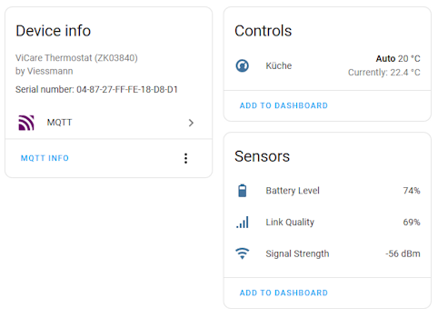
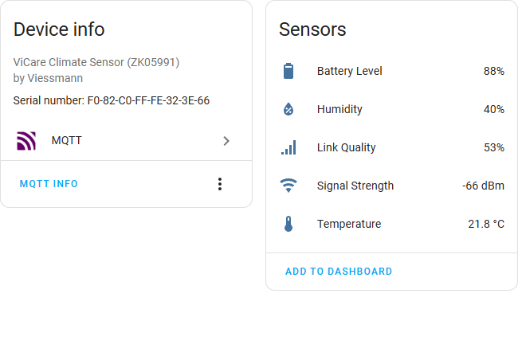

# **ViLocal** /  Local integration of Viessmann ViCare into MQTT + Home Assistant Device Discovery

 

> [!IMPORTANT]
> Neither this project, nor its author(s) have any affiliation with Viessmann (Group GmbH & Co. KG), ViCare, its products, or subsidiaries in any way, shape, or form. The projects efforts have been solely achieved through reverse engineering and by making use of the public / open source ZigBee specification. Whilst the goal of this project was, to provide local access to ViCare networks without interfering with the inner workings of the ViCare system, no warranty or guarantee can be given or provided. Use this project entirely at your own risk. There is no financial or commercial interest behind this work.

> [!NOTE]
> This project is based on the open-source [ZigBee Toolkit for Node.js](https://www.npmjs.com/package/zbtk).

## Introduction

**Welcome!** This project aims to make smart home components of [Viessmann's ViCare](https://www.viessmann.de/de/produkte/steuerung-und-konnektivitaet/vicare-app/komponenten.html), like thermostat vales (TRVs) and climate (temperature / humidity) sensors available for local use, without requiring any connection to the Viessmann servers / APIs and / or the internet. Viessmann has been [particularly "hesitant"](https://community.viessmann.de/t5/Getting-started-programming-with/Home-Assistant-Integration-von-ViCare-Sensoren-und-ViCare/m-p/521061) providing local access to ViCare components. This resulted in being stuck either not integrating the components into home automation (like Home Assistant), or buying into their paid API plans, starting with the very expensive "Advanced API" subscription, to be able to get access to the components, whilst still being stuck to internet-only access to the components trough their API.

Due to the [zero-install](https://yarnpkg.com/features/caching#zero-installs) approach provided by the Node.js package manager used (Yarn), ViLocal aims to work without any connection to the internet. As a result you will be able to download this repository, copy it to a USB stick, or directly onto your Raspberry PI and are ready to go capturing network traffic from your ViCare network.

### How does ViLocal work?

ViLocal utilizes the [ZigBee Toolkit for Node.js](https://www.npmjs.com/package/zbtk) and a technique widely known as "ZigBee Sniffing" to capture any communication between the ViCare devices and the ViCare bridge / coordinator Vitoconnect. The downside being that specialized hardware (see [tested devices](https://github.com/kristian/zbtk/blob/main/docs/tested-capture-devices.md) of the ZigBee Toolkit) is required, in order to be able to sniff into the Viessmann ZigBee network. However, the major upside of this approach is, that it is *completely non-intrusive*, meaning, ViLocal doesn't interfere with any of the internal workings of your ViCare / Viessmann network and that is fully local / requires no connectivity to the internet or Viessmann's APIs. No component in the existing network even "knowns" that ViLocal is listening.

Any captured attributes are then sent to your local (or remote, heck...) MQTT Broker and can be consumed by any home automation software, like Home Assistant. ViLocal implements the [MQTT (Device) Discovery](https://www.home-assistant.io/integrations/mqtt/#mqtt-discovery) protocol, to expose any found and / or configured thermostats and climate sensors automatically. If configured with the Home Assistant MQTT integration, Home Assistant will automatically pick up all found devices and create sensors / entities for them.

Currently this mechanism is read-only, meaning you will be able to monitor / get statistics of your thermostats and climate sensors. Changing the thermostat values / valves, e.g. by setting the desired target temperature is not (yet) possible.

## Set-Up / Installation

This guide describes how to set-up ViLocal using a Raspberry Pi and a Home Assistant OS installation. Due to the open and widely adopted nature of MQTT, a similar set-up on any other hardware, a VM or similar should be possible.

### 1. Set-up your Hardware for ZigBee Sniffing

The first step is to set-up your ZigBee sniffing hardware. This set-up is done on a clean Raspberry Pi with Raspberry Pi OS Lite (aka Raspbian w/o a desktop environment), however as mentioned beforehand, it should work on similar hardware / VMs as well.

Depending on which [supported capture hardware](https://github.com/kristian/zbtk/blob/main/docs/supported-capture-devices.md) you plan on using, follow the set-up instructions provided there. In my case I am using a Ubisys Wireshark stick, so the set-up is pretty straightforward, as described in the [manual provided by Ubisys](https://www.ubisys.de/wp-content/uploads/ubisys-ieee802154-wireshark-manual.pdf). First, grab yourself the Linux headers and kernel package required, in order to re-compile the needed network interface driver:

```bash
sudo apt-get update && sudo apt-get install -y linux-headers-$(uname –r) linux-libc-dev kernel-package
```

You can grab yourself a cup of coffee / tee, this will take some time to download and set-up.

After the installation is done, run `uname -r` to get the major / minor release of your Linux kernel, in my case `6.6.51+rpt-rpi-v7`, so 6.6. Proceed by downloading the Linux kernel sources:

```bash
sudo nano /etc/apt/sources.list
```

Uncomment the `deb-src` line at the end of the file, exit and save. Then proceed downloading the kernel sources for your release:

```bash
cd /usr/src
sudo apt-get update && sudo apt-get source linux-source-6.6
```

Download and extract the Ubisys IEEE 802.15.4 Wireshark USB stick driver package for Linux:

```bash
cd
wget http://www.ubisys.de/downloads/ubisys-m7b-rndis.tgz
tar -xzf ubisys-m7b-rndis.tgz
```

Copy the `rndis_host.c` file from the Linux kernel sources to the Ubisys driver folder, to patch it in the next step:

```bash
cd ubisys-m7b-rndis
cp /usr/src/linux-6*/drivers/net/usb/rndis_host.c .
```

Now patch the kernel module (note that is okay that some hunks cannot be applied), then `make` and `sudo make install` to apply the patch:

```bash
patch rndis_host.c rndis_host.c.patch
make
sudo make install
```

In my case (as tested February 17th 2025), patching the Debian 12 Bookworm sources on Kernel version `6.6.51+rpt-rpi-v7`, resulted in a compilation error on the `make` command. This is due to some renamed constants in the patch / driver. I had to patch the patch with:

```batch
sed -i 's/OID_STR(OID_/OID_STR(RNDIS_OID_/g' rndis_host.c
```

Afterwards repeat the `make` / `sudo make install`, which should now succeed. As a last step, as recommended by Ubisys, lets disable IPv6 for the interface:

```bash
echo "net.ipv6.conf.eth1.disable_ipv6 = 1" | sudo tee -a /etc/sysctl.conf
sudo sysctl -p
```

Validate that the `rndis_host` driver is currently not loaded. In case it is loaded, unload it before plugging in the USB capture stick to your Raspberry Pi:

```batch
lsmod
sudo rmmod rndis_wlan rndis_host
```

You are ready to plug-in your capture USB stick now. After plugging in the USB stick, use `dmesg` to check which interface the USB stick uses:

```batch
[547.998233] usb 1-1.4: new full-speed USB device number 4 using dwc_otg
[547.133729] usb 1-1.4: New USB device found, idVendor=19a6, idProduct=000a, bcdDevice= 1.05
...
[547.704199] rndis_host 1-1.4:1.0: RNDIS_MSG_QUERY(0x00010202) failed, -47
[547.707819] rndis_host ieee802154 channel is 11
[547.714346] rndis_host 1-1.4:1.0 eth1: register 'rndis_host' at usb-3f980000.usb-1.4, RNDIS device, 00:1f:ee:00:29:5e
[547.714591] usbcore: registered new interface driver rndis_host
[547.726540] usbcore: registered new interface driver rndis_wlan
```

As you can see in line `547.707819` the patch was applied successfully and ZigBee channel 11 was enabled, and in the following line `547.714346` you see that the interface name in my case was `eth1`. 

Nice, first steps complete and you are now ready to capture first packets in your ViCare ZigBee network.

### 2. Find the Channel of your ViCare Network and sniff for your Network Key

The next goal is to find the needed credentials to be able to sniff into the ViCare network. Most notably we have to find the channel of the ViCare ZigBee network, as well as the so called "Network Key", used for encrypting the traffic in the network. Let's get started.

Follow the [installation instructions of the ZigBee Toolkit](https://github.com/kristian/zbtk?tab=readme-ov-file#installation). In a nutshell, start by installing the PCAP libary:

```bash
sudo apt-get update && sudo apt-get install -y libpcap-dev
```

In case you have not installed Node.js yet, do that now as well:

```bash
cd
curl -fsSL https://deb.nodesource.com/setup_22.x -o nodesource_setup.sh
sudo -E bash nodesource_setup.sh
sudo apt-get install -y nodejs
```

Verify with `node -v` and enable corepack with:

```bash
node -v
sudo corepack enable
```

Then start executing the steps as described in the [application example of the ZigBee Toolkit](https://github.com/kristian/zbtk?tab=readme-ov-file#application-examples), to check for which ZigBee channel is used by your ViCare network. To speed up the process, I would recommend first downloading the ZigBee Toolkit:

```bash
cd
mkdir zbtk
cd zbtk
yarn init -2
yarn add zbtk
```

Then start looking for the right channel:

```bash
sudo rmmod rndis_wlan rndis_host
sudo ~/ubisys-m7b-rndis/ieee802154_options.sh –c 11
sudo yarn run zbtk cap eth1
```

Wait for a couple of seconds (depending on how busy your ZigBee network is), if you don't see any traffic, try with the next channel until you see packets logged to console:

```bash
> sudo rmmod rndis_wlan rndis_host
> sudo ./ieee802154_options.sh –c 19
> sudo yarn run zbtk cap eth1

{"protocol_id":"EX","version":2,"type":1,"channel_id":19,"device_id":65534,"lqi_mode":0,"lqi":170,"time":{"$hex":"d84f13c651a43783"},"seqno":3236,"length":12,"wpan":{"fcf":{"$hex":"6388"},"fc":{"reserved":false,"pan_id_compression":true,"ack_request":true,"pending":false,"security":false,"type":3,"src_addr_mode":2,"version":0,"dst_addr_mode":2,"ie_present":false,"seqno_suppression":false},"seq_no":2,"dst_pan":{"$hex":"de8c"},"dst16":{"$hex":"0000"},"src16":{"$hex":"f00d"},"cmd":{"id":{"$hex":"04"}},"ti_cc24xx_metadata":{"$hex":"f8ea"}}} (WPAN_CMD_DATA_REQ)
...
```

Now to keep following the instructions of the ZigBee Toolkit, you need a new ViCare ZigBee device, that you can newly join to the network. E.g. a spare ViCare thermostat or you can disconnect an existing thermostat and re-pair it with your ViCare network.

First step calculate the Link Key based on the Install Code of your device:

```bash
yarn run zbtk ic link EE917C25E94123C227B93F4D50A0C34F373D
```

Use the output `4c23a848a76f432113510a301c5fdfd2` as a pre-configured key and start capturing again:

```bash
export ZBTK_CRYPTO_PKS=4c23a848a76f432113510a301c5fdfd2
sudo yarn run zbtk cap eth1 --log attribute
```

Now (re-)join the ViCare device to the network, by pairing it with your network using the ViCare app. After some seconds, you should see a transport key message and the `Packet encrypted` warning messages should disappear:

```bash
Packet encrypted / decryption failed or not attempted
Set or check ZBTK_CRYPTO_(WELL_KNOWN_)PKS environment variable(s) or capture Transport Key
Packet encrypted / decryption failed or not attempted
...
------------------------------------------------------------

Captured Transport Key 52f0fe8052ebb35907daa243c95a2ff4

Key was automatically added to pre-configured key list

------------------------------------------------------------
```

Cool! You successfully sniffed `52f0fe8052ebb35907daa243c95a2ff4`, which is the Network Key of your ViCare network.

### 3. Prepare Home Assistant / ViLocal

Now that we know the channel & network key of our ViCare network, we can continue setting up Home Assistant (or any MQTT broker / home automation system, that you would like to use for that manner). In case you don't have a MQTT broker yet, or you want to use the most simple / straight forward set-up, follow the [installation instructions of the MQTT integration for Home Assistant](https://www.home-assistant.io/integrations/mqtt/). During the installation the MQTT installation will prompt you for whether you would like to use an existing broker, or install the Mosquitto add-on. We recommend setting up Mosquitto as your broker, as the whole set-up will be done by the MQTT integration.

After the installation is done, open your Home Assistant Settings, goto Add-Ons, Mosquitto broker and go to the Configuration tab. To the "Logins" textarea, add a user & password, that we are going to use later on to set-up in ViLocal:

```text
- username: mqtt
  password: abcd1234
```

Press save and continue with the next step. Back on your Raspberry Pi, we can now start setting up ViLocal. ViLocal uses what is called [zero-install](https://yarnpkg.com/features/caching#zero-installs) by Yarn. Meaning copying this repository onto your Raspberry Pi should be enough to get it installed:

```bash
cd
wget https://github.com/kristian/ViLocal/archive/refs/heads/main.zip
unzip main.zip
```

In order to compile the PCAP binaries on your Raspberry Pi, it is still require to run a `yarn install`:

```bash
cd ViLocal-main
yarn install
```

Now start editing the `config.toml` configuration file:

```bash
nano config.toml
```

We change the following options:

- `device`: To match your network interface, `eth1` in my case
- `network_key`: To the previously captured network key, so `52f0fe8052ebb35907daa243c95a2ff4` in this example
- `mqtt.broker`: To the broker URL / the host of your Home Assistant installation, e.g.: `mqtt://192.168.1.10:1883`
- `mqtt.username` and `mqtt.password`: To the user and password that we created in the last step. User `mqtt`, password `abcd1234`

With these changes, we can go ahead save the file and would be ready to start using ViLocal. However in order to expose your ViCare thermostats to Home Assistant with the names as they appear for instance in your ViCare app and to associate any ViCare climate sensors in the room to their associated thermostats, it is recommended to list out all your ViCare devices in the `config.toml` file as well. If you skip this step, ViLocal will automatically publish found ViCare devices to your MQTT broker with generic names (Thermostat 1, Thermostat 2, etc.) anyways.

In order to set-up thermostats / climate sensors, just add the following section for each device in your ViCare network:

```toml
[thermostats]

[thermostats.bedroom]
serial_no = "AB-CD-EF-01-02-03-04-05"
name = "Bedroom"

[thermostats.bathroom]
serial_no = "FE-DC-BA-01-02-03-04-05"
name = "Bathroom"
```

You will find the serial number / EUI-64 printed on the label of the device, or if you navigate to the thermostat / climate sensor in your ViCare app, you can easily copy the serial number in the device settings. In the ViCare app goto the room the thermostat / climate sensor is in, press the "..." menu in the top right, scroll down to "connected devices" and the serial number should appear at the top of of the device.

In case you would like to use a climate sensor for a thermostat, instead of relying on the internal temperature readings, just set the `climate_sensor_serial_no` as well:

```toml
[thermostats.bathroom]
serial_no = "FE-DC-BA-01-02-03-04-05"
name = "Bathroom"
climate_sensor_serial_no = "FF-EE-DD-CC-BB-AA-00-00"
```

Whilst not strictly required, in order to also expose this device to home assistant, list it in the `[climate_sensors]` section as well:

```toml
[climate_sensors]

[climate_sensors.bathroom]
serial_no = "FF-EE-DD-CC-BB-AA-00-00"
name = "Bathroom"
```

That should be it! Start up ViLocal:

```bash
sudo yarn run start
```

In case there are no warning / errors printed to your logs, data should start being published to your MQTT Broker soon and the devices should get announced and appear in your Home Assistant installation automatically.

### 4. Run ViLocal as a Service

The last step of this tutorial is setting up to run ViLocal as a `systemd` service, instead of running it manually. Create a new service definition:

```bash
sudo nano /etc/systemd/system/vilocal.service
```

Here is a suggested `vilocal.service` file:

```ini
[Unit]
Description=ViLocal
After=network.target
Wants=network.target

[Service]
Type=exec
User=root
WorkingDirectory=/home/kristian/ViLocal-main
ExecStartPre=/sbin/modprobe -r rndis_wlan rndis_host
ExecStartPre=/bin/bash -c '/home/kristian/ubisys-m7b-rndis/ieee802154_options.sh -c 19'
ExecStartPre=/sbin/ip link set dev eth1 up
ExecStart=/usr/bin/yarn run start
Restart=on-failure

[Install]
WantedBy=multi-user.target
```

Don't forget to adapt:

- The `WorkingDirectory` path to the ViLocal directory `/home/kristian/ViLocal-main`
- The `ExecStartPre` ZigBee channel for capture `19`
- The `ExecStartPre` interface of your capture device `eth1`
 
Test the service with:

```bash
sudo systemctl daemon-reload
sudo systemctl start vilocal.service
sudo systemctl status
```

If you see ViLocal running, enable the service, to run it automatically after startup:

```bash
sudo systemctl enable vilocal.service
```

Congratulations! You just set-up a fully local integration of your ViCare thermostats and climate sensors into Home Assistant!

## Author

ViLocal by [Kristian Kraljić](https://kra.lc/).

## Bugs

Please file any questions / issues [on Github](https://github.com/kristian/ViLocal/issues).

Any ideas / comments, or just want to chat? Feel free to [start a discussion](https://github.com/kristian/ViLocal/discussions).

## License

This library is licensed under the [Apache 2.0](LICENSE) license.
