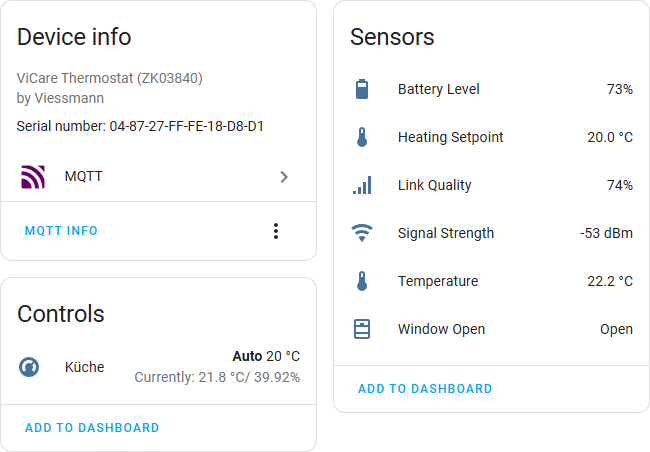

# **ViLocal** /  Local integration of Viessmann ViCare into MQTT + Home Assistant Device Discovery

 

> [!IMPORTANT]
> Neither this project, nor its author(s) have any affiliation with Viessmann (Group GmbH & Co. KG), ViCare, its products, or subsidiaries in any way, shape, or form. The projects efforts have been solely achieved through reverse engineering and by making use of the public / open source ZigBee specification. Whilst the goal of this project was, to provide local access to ViCare networks without interfering with the inner workings of the ViCare system, no warranty or guarantee can be given or provided. Use this project entirely at your own risk. There is no financial or commercial interest behind this work.

> [!NOTE]
> This project is based on the open-source [ZigBee Toolkit for Node.js](https://www.npmjs.com/package/zbtk).

## Introduction

**Welcome!** This project aims to make smart home components of [Viessmann's ViCare](https://www.viessmann.de/de/produkte/steuerung-und-konnektivitaet/vicare-app/komponenten.html), like thermostat vales (TRVs) and climate (temperature / humidity) sensors available for local use, without requiring any connection to the Viessmann servers / APIs and / or the internet. Viessmann has been [particularly "hesitant"](https://community.viessmann.de/t5/Getting-started-programming-with/Home-Assistant-Integration-von-ViCare-Sensoren-und-ViCare/m-p/521061) providing local access to ViCare components. This resulted in being stuck either not integrating the components into home automation (like Home Assistant), or buying into their paid API plans, starting with the very expensive "Advanced API" subscription, to be able to get access to the components, whilst still being stuck to internet-only access to the components trough their API.

Due to the [zero-install](https://yarnpkg.com/features/caching#zero-installs) approach provided by the Node.js package manager used (Yarn), ViLocal aims to work without any connection to the internet. As a result you will be able to download this repository, copy it to a USB stick, or directly onto your Raspberry PI and are ready to go capturing network traffic from your ViCare network.

### How does ViLocal work?

ViLocal utilizes the [ZigBee Toolkit for Node.js](https://www.npmjs.com/package/zbtk) and a technique widely known as "ZigBee Sniffing" to capture any communication between the ViCare devices and the ViCare bridge / coordinator Vitoconnect. The downside being that specialized hardware (see [tested devices](https://github.com/kristian/zbtk/blob/main/docs/tested-capture-devices.md) of the ZigBee Toolkit) is required, in order to be able to sniff into the Viessmann ZigBee network. However, the major upside of this approach is, that it is *completely non-intrusive*, meaning, ViLocal doesn't interfere with any of the internal workings of your ViCare / Viessmann network and that is fully local / requires no connectivity to the internet or Viessmann's APIs. No component in the existing network even "knowns" that ViLocal is listening.

Any captured attributes are then sent to your local (or remote, heck...) MQTT Broker and can be consumed by any home automation software, like Home Assistant. ViLocal implements the [MQTT (Device) Discovery](https://www.home-assistant.io/integrations/mqtt/#mqtt-discovery) protocol, to expose any found and / or configured thermostats and climate sensors automatically. If configured with the Home Assistant MQTT integration, Home Assistant will automatically pick up all found devices and create sensors / entities for them.

> [!NOTE]
> Whilst only certain attributes are being visualized through the device discovery feature, all parameters read from, written to, or reported by your devices will be published via MQTT. This includes all hidden / vendor-specific attributes of our Viessmann ViCare devices.

Currently this mechanism is **read-only**, meaning you will be able to monitor / get statistics of your thermostats and climate sensors. Changing the thermostat values / valves, e.g. by setting the desired target temperature is not (yet) possible.

## Set-Up / Installation

This guide describes how to set-up ViLocal using a Raspberry Pi and a Home Assistant OS installation. Due to the open and widely adopted nature of MQTT, a similar set-up on any other hardware, a VM or similar should be possible.

### 1. Set-up your Hardware for ZigBee Sniffing

The first step is to set-up your ZigBee sniffing hardware. This set-up is done on a clean Raspberry Pi with Raspberry Pi OS Lite (aka Raspbian w/o a desktop environment), however as mentioned beforehand, it should work on similar hardware / VMs as well.

Depending on which [capture hardware](https://github.com/kristian/zbtk/blob/main/docs/tested-capture-devices.md) you plan on using, follow the set-up instructions provided. In my case I was first using a Ubisys Wireshark stick and later switched to an SMLIGHT SLZB-06M ethernet dongle. For both devices the set-up was quite straight forward. A major advantage of the SMLIGHT dongle, compared to the Ubisys stick is, that it can be freely placed anywhere in your house using ethernet / PoE and also the set-up does not require any drivers or manual patching of the Linux kernel. The SMLIGHT dongle is a true "out-of-the-box" solution, just make sure the device & radio firmware are up-to-date, by using the OTA update in its web UI and you are ready to go! 

Now is a good time to also install Node.js in case you haven't done so, yet. Please make sure you check the required Node.js engine version and install it on your machine:

```bash
cd
curl -fsSL https://deb.nodesource.com/setup_24.x -o nodesource_setup.sh
sudo -E bash nodesource_setup.sh
sudo apt-get install -y nodejs
```

Verify with `node -v` and enable corepack with:

```bash
node -v
sudo corepack enable
```

While you are at it, also install the ZigBee Toolkit (`zbtk`), it will come in handy later:

```bash
npm install -g zbtk
```

Follow any other steps required in the [capture device list of the ZigBee Toolkit](https://github.com/kristian/zbtk/blob/main/docs/tested-capture-devices.md), for example, when using the SMLIGHT stick, we will use a CLI tool called `ember-sniff` to pipe in the required (P)CAP data into ViLocal, so install it as well:

```bash
npm install -g ember-sniff
```

Nice, first steps complete and you are now ready to capture first packets in your ViCare ZigBee network.

### 2. Find the Channel of your ViCare Network and sniff for your Network Key

The next goal is to find the needed credentials to be able to sniff into the ViCare network. Most notably we have to find the channel of the ViCare ZigBee network, as well as the so called "Network Key", used for encrypting the traffic in the network. Let's get started.

Follow the [installation instructions of the ZigBee Toolkit](https://github.com/kristian/zbtk?tab=readme-ov-file#installation). Then start executing the steps as described in the [application example of the ZigBee Toolkit](https://github.com/kristian/zbtk?tab=readme-ov-file#application-examples), to check for which ZigBee channel is used by your ViCare network.

Depending on the [capture device](https://github.com/kristian/zbtk/blob/main/docs/tested-capture-devices.md) you use, switching channels might be slightly different. However essentially it always comes down to changing a parameter to switch the channel and trial and error iterating through all possible channels 11-26, until you find the channel ZigBee data is transmitted on:

```bash
ember-sniff -p tcp://192.168.1.42:6638 -c 11 | tcpdump -vvv -r -
# ... repeat until you found the channel sending ZigBee data
ember-sniff -p tcp://192.168.1.42:6638 -c 12 | tcpdump -vvv -r -
# ...
```

Wait for a couple of seconds (depending on how busy your ZigBee network is), if you don't see any traffic, try with the next channel until you see packets. Afterwards you can already try to run the ZigBee Toolkit to see the parsed output of your network:

```bash
> ember-sniff -p tcp://192.168.1.42:6638 -c 19 | zbtk cap

{"protocol_id":"EX","version":2,"type":1,"channel_id":19,"device_id":65534,"lqi_mode":0,"lqi":170,"time":{"$hex":"d84f13c651a43783"},"seqno":3236,"length":12,"wpan":{"fcf":{"$hex":"6388"},"fc":{"reserved":false,"pan_id_compression":true,"ack_request":true,"pending":false,"security":false,"type":3,"src_addr_mode":2,"version":0,"dst_addr_mode":2,"ie_present":false,"seqno_suppression":false},"seq_no":2,"dst_pan":{"$hex":"de8c"},"dst16":{"$hex":"0000"},"src16":{"$hex":"f00d"},"cmd":{"id":{"$hex":"04"}},"ti_cc24xx_metadata":{"$hex":"f8ea"}}} (WPAN_CMD_DATA_REQ)
...
```

Now to keep following the instructions of the ZigBee Toolkit, you need a new ViCare ZigBee device, that you can newly join to the network. E.g. a spare ViCare thermostat or you can disconnect an existing thermostat and re-pair it with your ViCare network.

First step calculate the Link Key based on the Install Code of your device:

```bash
zbtk ic link EE917C25E94123C227B93F4D50A0C34F373D
```

Use the output `4c23a848a76f432113510a301c5fdfd2` as a pre-configured key and start capturing again:

```bash
export ZBTK_CRYPTO_PKS=4c23a848a76f432113510a301c5fdfd2
ember-sniff -p tcp://192.168.1.42:6638 -c 19 | zbtk cap --log attribute
```

Now (re-)join the ViCare device to the network, by pairing it with your network using the ViCare app. After some seconds, you should see a transport key message and the `Packet encrypted` warning messages should disappear:

```bash
Packet encrypted / decryption failed or not attempted
Set or check ZBTK_CRYPTO_(WELL_KNOWN_)PKS environment variable(s) or capture Transport Key
Packet encrypted / decryption failed or not attempted
...
------------------------------------------------------------

Captured Transport Key 52f0fe8052ebb35907daa243c95a2ff4

Key was automatically added to pre-configured key list

------------------------------------------------------------
```

Cool! You successfully sniffed `52f0fe8052ebb35907daa243c95a2ff4`, which is the Network Key of your ViCare network.

### 3. Prepare Home Assistant / ViLocal

Now that we know the channel & network key of our ViCare network, we can continue setting up Home Assistant (or any MQTT broker / home automation system, that you would like to use for that manner). In case you don't have a MQTT broker yet, or you want to use the most simple / straight forward set-up, follow the [installation instructions of the MQTT integration for Home Assistant](https://www.home-assistant.io/integrations/mqtt/). During the installation the MQTT installation will prompt you for whether you would like to use an existing broker, or install the Mosquitto add-on. We recommend setting up Mosquitto as your broker, as the whole set-up will be done by the MQTT integration.

After the installation is done, open your Home Assistant Settings, goto Add-Ons, Mosquitto broker and go to the Configuration tab. To the "Logins" textarea, add a user & password, that we are going to use later on to set-up in ViLocal:

```text
- username: mqtt
  password: abcd1234
```

Press save and continue with the next step. Back on your Raspberry Pi, we can now start setting up ViLocal. ViLocal uses what is called [zero-install](https://yarnpkg.com/features/caching#zero-installs) by Yarn. Meaning copying the ViLocal repository onto your Raspberry Pi should be enough to get it installed:

```bash
cd
wget https://github.com/kristian/ViLocal/archive/refs/heads/main.zip
unzip main.zip
```

Alternatively, in case you have `git` installed locally (and your device is connected to the internet) you can also clone the repository, allowing you to easily upgrade ViLocal using a `git pull` in future:

```bash
git clone https://github.com/kristian/ViLocal.git
```

Start by editing the `config.toml` configuration file:

```bash
cd ViLocal-main
nano config.toml
```

In case you used a `git clone`, it might be more favorable for you to copy the configuration file to a `local-config.toml`, to avoid any merge conflicts when upgrading ViLocal in future.

Now change the following options:

- `network_key`: To the previously captured network key, so `52f0fe8052ebb35907daa243c95a2ff4` in this example
- `mqtt.broker`: To the broker URL / the host of your Home Assistant installation, e.g.: `mqtt://192.168.1.10:1883`
- `mqtt.username` and `mqtt.password`: To the user and password that we created in the last step. User `mqtt`, password `abcd1234`

With these changes, we can go ahead save the file and would be ready to start using ViLocal. However in order to expose your ViCare thermostats to Home Assistant with the names as they appear for instance in your ViCare app and to associate any ViCare climate sensors in the room to their associated thermostats, it is recommended to list out all your ViCare devices in the `config.toml` file as well. If you skip this step, ViLocal will automatically publish found ViCare devices to your MQTT broker with generic names (Thermostat 1, Thermostat 2, etc.) anyways.

In order to set-up thermostats / climate sensors, just add the following section for each device in your ViCare network:

```toml
[thermostats]

[thermostats.bedroom]
serial_no = "AB-CD-EF-01-02-03-04-05"
name = "Bedroom"

[thermostats.bathroom]
serial_no = "FE-DC-BA-01-02-03-04-05"
name = "Bathroom"
```

You will find the serial number / EUI-64 printed on the label of the device, or if you navigate to the thermostat / climate sensor in your ViCare app, you can easily copy the serial number in the device settings. In the ViCare app goto the room the thermostat / climate sensor is in, press the "..." menu in the top right, scroll down to "connected devices" and the serial number should appear at the top of of the device.

In case you would like to use a climate sensor for a thermostat, instead of relying on the internal temperature readings, just set the `climate_sensor_serial_no` as well:

```toml
[thermostats.bathroom]
serial_no = "FE-DC-BA-01-02-03-04-05"
name = "Bathroom"
climate_sensor_serial_no = "FF-EE-DD-CC-BB-AA-00-00"
```

Whilst not strictly required, in order to also expose this device to home assistant, list it in the `[climate_sensors]` section as well:

```toml
[climate_sensors]

[climate_sensors.bathroom]
serial_no = "FF-EE-DD-CC-BB-AA-00-00"
name = "Bathroom"
```

That should be it! Start up ViLocal and use the same piped input stream of your device, that you had been using before to start the ZigBee Toolkit:

```bash
ember-sniff -p tcp://192.168.1.42:6638 -c 19 | yarn run start
```

In case there are no warning / errors printed to your logs, data should start being published to your MQTT Broker soon and the devices should get announced and appear in your Home Assistant installation automatically.

### 4. Run ViLocal as a Service

The last step of this tutorial is setting up to run ViLocal as a `systemd` service, instead of running it manually. Create a new service definition:

```bash
sudo nano /etc/systemd/system/vilocal.service
```

Here is a suggested `vilocal.service` file:

```ini
[Unit]
Description=ViLocal
After=network.target
Wants=network.target

[Service]
Type=exec
User=root
WorkingDirectory=/home/kristian/ViLocal-main
ExecStart=/bin/bash -c '/usr/bin/ember-sniff -p tcp://192.168.1.42:6638 -c 19 | /usr/bin/yarn run start'
Restart=on-failure

[Install]
WantedBy=multi-user.target
```

Don't forget to adapt:

- The `WorkingDirectory` path to the ViLocal directory `/home/kristian/ViLocal-main`
- The ZigBee channel for capture `19`

In case you are using the Ubisys Wireshark stick, add the following line to the `[Service]` section:

```ini
ExecStartPre=/sbin/modprobe -r rndis_wlan rndis_host
ExecStartPre=/bin/bash -c '/home/kristian/ubisys-m7b-rndis/ieee802154_options.sh -c 19'
ExecStartPre=/sbin/ip link set dev eth1 up
```

Also here don't forget to adapt the channel and path to your `ubisys-m7b-rndis` driver package.

Test the service with:

```bash
sudo systemctl daemon-reload
sudo systemctl start vilocal.service
sudo systemctl status
```

If you see ViLocal running, enable the service, to run it automatically after startup:

```bash
sudo systemctl enable vilocal.service
```

Congratulations! You just set-up a fully local integration of your ViCare thermostats and climate sensors into Home Assistant!

## Author

ViLocal by [Kristian Kraljić](https://kra.lc/).

## Bugs

Please file any questions / issues [on Github](https://github.com/kristian/ViLocal/issues).

Any ideas / comments, or just want to chat? Feel free to [start a discussion](https://github.com/kristian/ViLocal/discussions).

## License

This library is licensed under the [Apache 2.0](LICENSE) license.
